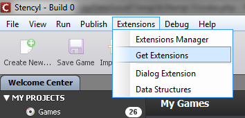
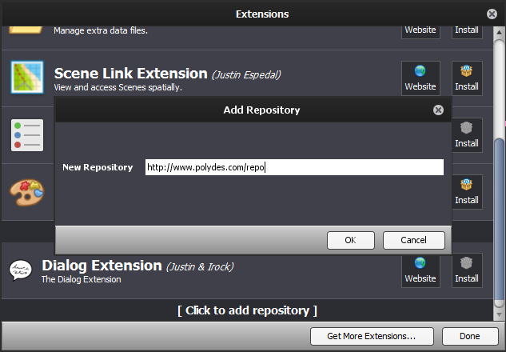
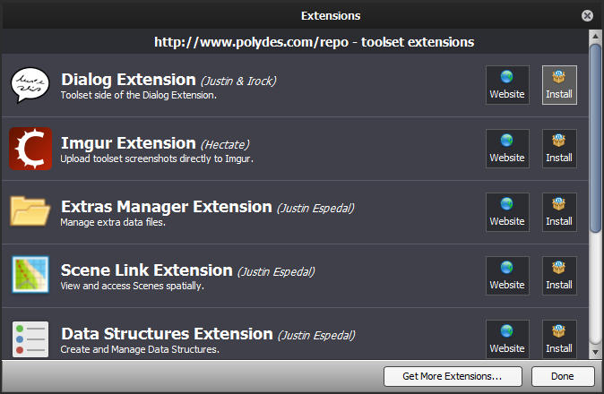
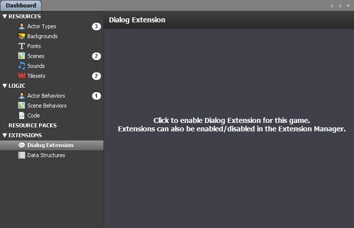
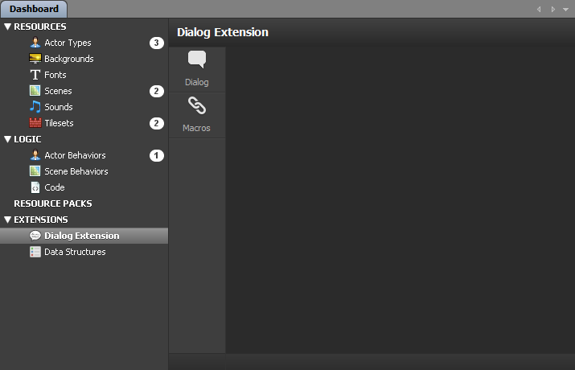

## How to Install/Update

This extension is made of **three parts**:

1. The Dialog Toolset Extension. This allows dialog to be written within the Stencyl interface.
2. The Data Structures Extension. This is used as a backend to provide a user-friendly interface for editing dialog settings.
3. The Dialog Engine Extension. This provides the code for drawing and executing your dialog scripts at runtime.

The easiest way to install is to use Stencyl's built-in Extension Manager to install them all together.

1) Extensions > Get Extensions

  

2) Enable external repositories and add "http://www.polydes.com/repo"

  

3) Install "Dialog Extension"

  

## How to Enable the Extension in Your Game

1) Open a game and select "Dialog Extension" in the sidebar

  

2) Click in the center panel to enable it for that game

  

##### Optional Step:

For easier initial setup, you can copy all of the settings of the "Dialog Extension Sample" to your game.

1. Import "Dialog Extension Sample" into your Stencyl workspace.
2. Copy the content of `[Your Stencyl Workspace]/games/Dialog Extension Sample/extras` into `[Your Stencyl Workspace]/games/[Your Game]/extras`

This brings most of the settings of the sample game into yours, with a few exceptions:
- Sounds, the "pointer" Actor Type, and controls need to be set to resources in your Stencyl game.

## Using the Extension

Open your game in Stencyl.

On the sidebar in the Dashboard, there are two items under "Extensions" that we will use.

- `Data Structures`: Most of the preferences related to dialog presentation can be edited here.
- `Dialog Extension`: The scripts used to display dialog can be written here.

To display your dialog in the game, some custom blocks are included:

The following blocks use the name of a dialog script to start dialog.

```
- show dialog [ ... ]
- show dialog [ ... ] and trigger event [ ... ] upon completion
- show dialog [ ... ] with style [ ... ]
- show dialog [ ... ] with style [ ... ] and trigger event [ ... ] upon completion
```

- The field after "show dialog" is filled with the name of the Dialog Chunk you wish to display.
- If one of the no-style blocks is used, the default "base" style is shown.
- If a "trigger event" block is used, once the dialog is ended with the `<end>` tag, the specified Custom Event is called.

There are four alternate blocks, `show text [ ... ] ...` which you can use to call a dialog with text from an attribute.

```example
//You can place text directly into the block, and it will be converted into a dialog script.//
show text [Hi Lenny!<but> What's up?<but><end>]

//You can also store the text into an attribute, and place the attribute into the "show text" block.//
set My Dialog Attribute to [Hi Lenny!<but> What's up?<but><end>]
show text [My Dialog Attribute]
```

In addition, you can set up a Game Attribute to always be `true` if a Dialog is open, which can be used for game rules such as disallowing player movement during dialog.  
The setting for this is in `Data Structures > Default Style > Basic Settings > Control Attribute`. Just set it equal to the name of the Game Attribute you want set to true while Dialog is open.

## Documentation

It's a good idea to install the included "Dialog Extension Sample" and see how it works. Look through the settings for the Dialog Extension and Data Structures, and you can see how dialog is shown in the events for "Good Scene."

See the [command reference](index.php?f=command_reference) for information on using the Dialog Extension's scripting capabilities.