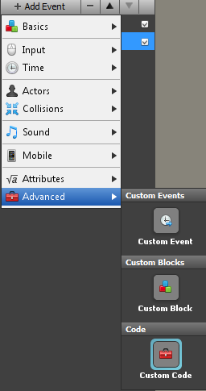
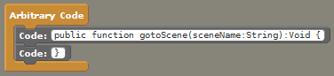
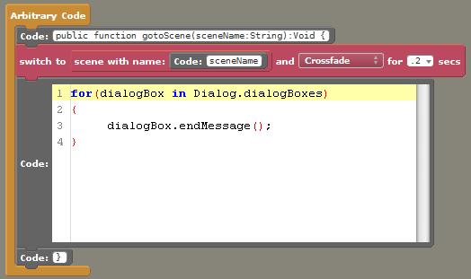
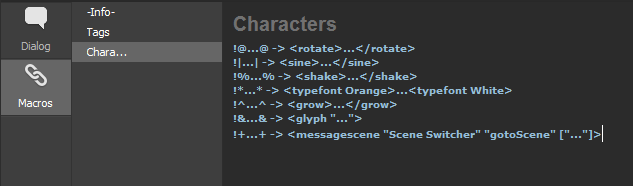
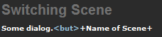

This guide covers a basic way of telling Stencyl to switch to another scene by using dialog tags. The same technique can be used to supplement the Dialog Extension with many other capabilities.

We will use the `<messagescene behaviorName:String messageName:String [args...]>` command to send a message to a behavior in the current scene.
The behavior that receives the message will have custom code to switch scenes, and the behavior should be attached to each scene which will have scene-switching dialog.

Here's how you set it all up.

(Use the search bar in Design Mode if you're having trouble finding any of these blocks.)

1) Create a scene behavior that you will have attached to each scene with dialog in it. If you already have a suitable behavior, you can use that.

2) Create a "Custom Code" event.



3) Remove the large code block, and in its place use two small code blocks. Put the following code into the two blocks.

```
public function gotoScene(sceneName:String):Void {
}
```

Now you can place blocks in between the two small code blocks and those blocks will be executed when you call the gotoScene function.



4) Place a switch to scene block in your function, and have it switch to the scene with the specified name. Also, because we need to clean up remaining dialog of we use this function, place a large code block with the following code:

```
for(dialogBox in Dialog.dialogBoxes)
{
	dialogBox.endMessage();
}
```



5) Make sure to attach the behavior you've created to your scenes.

6) It can now be called like this in your dialog:  
`<messagescene "Name of Behavior" "gotoScene" ["Name of Scene"]>`

For example, if the behavior with the scene switching function is called "Scene Switcher", and you want to switch to a scene with the name "Scene 2", you would use this:  
`<messagescene "Scene Switcher" "gotoScene" ["Scene 2"]>`

If you want to make it easier to use, you can create a "Character" macro.



I used + in that example, so my dialog would look like this using that macro.

